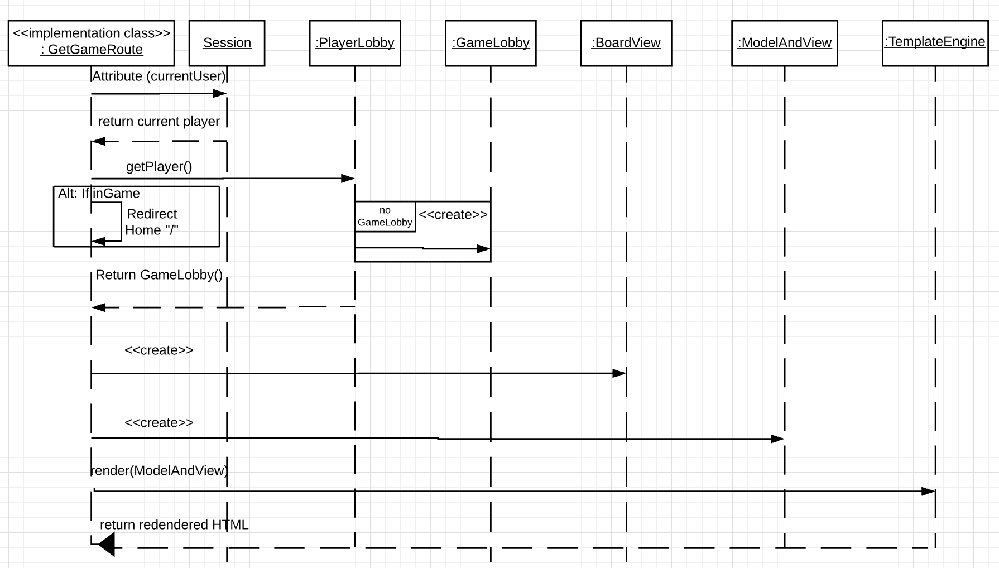

# PROJECT Design Documentation

> _The following template provides the headings for your Design
> Documentation.  As you edit each section make sure you remove these
> commentary 'blockquotes'; the lines that start with a > character
> and appear in the generated PDF in italics._

## Team Information
* Team name: Checkm8
* Team members
  * Spencer Josi
  * Casper Loveless
  * Ryan Madulka
  * Alan Read

## Executive Summary

Our web-based checkers application will provide an interactive user experience as players can play against other online
users. It will incorporate sign-in functionality as each user can specify who they want to play against, directing both
users to a game page presenting a GUI with the game board. The checkers game will also have drag-and-drop piece
capabilities as a user can submit their moves when they drop their piece in a valid position. Not only will users be
able to play against other online users, but they can compete against an AI or can record games to replay move-by-move.

### Purpose
We want to develop a web application for all users to play checkers against other live opponents, abiding by the American
checkers rules and providing a fully functional server-client connection.

### Glossary and Acronyms
> _Provide a table of terms and acronyms._

| Term | Definition |
|------|------------|
| VO | Value Object |

## Requirements

The most essential components of Webcheckers is to have sign-in functionality, initiating games with other players, and
the ability to play a game of checkers according to the American Rules on a GUI with drag-and-drop pieces. In order to
adhere to the checkers rulebook, developing a system to thoroughly validate moves is mandatory as the code must review
moves made by the player and asses its validity once the user has submitted their turn.

### Definition of MVP
The Minimum Value Product expresses the most essential requirements that must be developed
and included within the product in order for it to be satisfactory.

### MVP Features
A user must be able to sign in and out of their account, and if they remain logged in they
can initiate a game with a selected online user. Both users will be transferred to a game board
screen consisting of all of the checker pieces, along with buttons giving them the option to resign the game
the game, backup their most recent move, or submit their valid turn. When done playing, users can sign out of their account.

### Roadmap of Enhancements

We have already completed sign-in functionality and the basic structure of the board, so our current sprint plan
is to complete valid piece movement, develop game structure as users must be able to submit their turn or resign,
and also to create sign-out functionality. We are expecting to finish the MVP within this sprint, as sprint 3 is
devoted to completing our enhancements where we want to implement an AI and a replay mode to record and playback previous games.

## Application Domain

This section describes the application domain.

The Checkers WebApp is played by two Players on a single checkers GameBoard.
The GameBoard contains 64 Squares, with each having a Location and a Color(Dark/Light).
24 Pieces are initially placed on the GameBoard, and each Player takes control of 12.
One Piece can occupy one Square. Each Piece has a Color(Red/White) and can either
be a Single Piece or a King Piece. A Player can either be a human Player or an AI Player,
and a Player has the ability to replay a Game.

## Architecture and Design

This section describes the application architecture.

In the application, our design focuses on utilizing MVC. The user is able to interact with everything in the view which
includes the ftl, CSS and JavaScript. The controller consists of the two application tier classes PlayerLobby and
GameLobby which are invoked by most of the UI tier handler classes. The model contains most of the move validation and stores the
information related to players and the positions on the board. We designed the board using a 2d array so we could iterate
through to find specific pieces and to validate the moves of a piece. Furthermore, we implemented iterator to populate the
board in the ftl so that the user could see and interact with a changing board. When implementing move validation, we decided
to use an abstract class that different move classes extended to make it easier to check for valid moves. We split this into
checking for a jump, a simple move, a backwards king move and a backwards king jump. By splitting these rules into
separate classes, we were able to follow high cohesion and polymorphism principles. This also made it easier to determine
if a move was legal since we could just call the abstract method to determine if the given move was valid based on our
rules. However, by doing this, we had to create a util tier class that contained static boolean methods that utilized
the abstract class. This was not the best design choice but was the "cleanest" way we could think about going about
validation.

### Summary

The following Tiers/Layers model shows a high-level view of the webapp's architecture.

As a web application, the user interacts with the system using a
browser.  The client-side of the UI is composed of HTML pages with
some minimal CSS for styling the page.  There is also some JavaScript
that has been provided to the team by the architect.

The server-side tiers include the UI Tier that is composed of UI Controllers and Views.
Controllers are built using the Spark framework and View are built using the FreeMarker framework.  The Application and Model tiers are built using plain-old Java objects (POJOs).

Details of the components within these tiers are supplied below.

### Overview of User Interface

This section describes the web interface flow; this is how the user views and interacts
with the WebCheckers application.

When the user first connects to the web application, they are sent to the home page. By clicking on the sign-in button,
on the top left of the screen, the user is then sent to the sign-in page in which they can then enter a username.
Assuming the user inputs a valid username and they click on the sign-in button, they will be sent back to the home page.
If the player enters an invalid username, the sign-in page will reload. Once they are back on the home page and the user
chooses to play an online user, they will both be sent to the game screen. On the game page, each player takes turns making
moves and the page updates after each move is made. Once the game is over, the player will be sent back to the homepage.

### UI Tier
> _Provide a summary of the Server-side UI tier of your architecture.
> Describe the types of components in the tier and describe their
> responsibilities.  This should be a narrative description, i.e. it has
> a flow or "story line" that the reader can follow._

The user begins by connecting to the web page by invoking GetHomeRoute in which they are prompted with a sign in link. When the user signs in,
GetSignInRoute is called. When the user enters a name, PostSignInRoute is called; if the name is valid, the user will be
directed home, otherwise the page displays an error message and the user can try again. Back home, the user can see and
click on other online players. If another player is clicked on, GetGameRoute is invoked; if the clicked on player is
already in a game, the user is sent home with and error message, otherwise a game is created between the two players and
both are sent to the GameView page. When a player moves a piece, PostProposedMoveRoute is invoked, which determines
whether or not the individual move is valid. If the move is valid, the player can hit the submit button, which invokes
PostSubmitTurnRoute, which validates the entire turn before actually making the moves on the board. While a player is
deciding a turn, the opponent is invoking PostCheckTurnRoute which checks to see if it their turn yet. At any point a
player can resign, in which PostResignRoute is invoked, which ends the game and displays an exit gameView. If a player
tries to resign after a game has ended, the PostResignRoute will not allow resignation. When the exit page is displayed,
the user can press the exit button, in which ExitGameRoute is invoked, which removes the player from the GameLobby
and redirects them back home. At home, a user can hit the sign out link, which invokes PostSignOutRoute, which removes
the user from the PlayerLobby. A player cannot sign out during a game.

A state diagram that shows the overall states of playing a game. The PostSubmitTurn and PostCheckTurn routes are used to
change the turns during the game. GetGameRoute is used to load the game page. PostExitGame is used to go back to the home
page.

Shows the UML diagram of the UI tier classes.

Shows the state diagram of the player waiting for their turn.

Shows the sequence diagram of the GetGameRoute

> _At appropriate places as part of this narrative provide one or more
> static models (UML class structure or object diagrams) with some
> details such as critical attributes and methods._

> _You must also provide any dynamic models, such as statechart and
> sequence diagrams, as is relevant to a particular aspect of the design
> that you are describing.  For example, in WebCheckers you might create
> a sequence diagram of the `POST /validateMove` HTTP request processing
> or you might show a statechart diagram if the Game component uses a
> state machine to manage the game._

> _If a dynamic model, such as a statechart describes a feature that is
> not mostly in this tier and cuts across multiple tiers, you can
> consider placing the narrative description of that feature in a
> separate section for describing significant features. Place this after
> you describe the design of the three tiers._

### Application Tier
Our application tier consists of two classes that are both intended to manage board logic along with providing
services to the UI tier. PlayerLobby directly manages all online users and GameLobby manages users that are both
in a current game together, allowing UI classes to directly access user information as the application classes are implemented
within the UI tier.

Both application classes include information such as the board, players, moves, and game statuses,
allowing the UI classes to extract that data and have it visible to both users.
> _Provide a summary of the Application tier of your architecture. This
> section will follow the same instructions that are given for the UI
> Tier above._

### Model Tier
The root of our model tier is our board class which initiates our board as a 2-d array that is compiled of a variety of
types of objects. It is comprised of Spaces, which creates the layout of the board of dark and white tiles, and those
Spaces contains Pieces, which the users move diagonally on dark tiles utilizing different valid movement techniques in
order to remove the opponent's pieces through jump moves. For piece movement, we developed a Position class that tracked
player movement with row and column coordinates and those positions were stored within a Move object that contained a
start and end position, checking whether or not those two positions represented a valid move. Once the Move object was
instantiated, it then would go through a utility class called MoveProcessor that called a variety of move checking model
classes to ensure the user made a valid move. Within MoveProcessor, we created an array with the object type "Rules",
which is an abstract class being extended in a variety of move validating model classes. Some of those classes, such as
JumpMove, KingSimpleMove, KingJumpMove, and SimpleMove, all validate the Move based on its positions and piece status. For
CheckAllJumpMove, CheckSimpleMove, and CheckOneJumpMove, those classes review whether a multi-jump move, a simple move, or
a force jump move are available, respectively.

The KingJumpMoveValidation() Statechart demonstrates how the method processes on determining whether
or not the current move is a valid King Jump Move. It initially is called by MoveProcessor and then the
current move is retrieved and analyzed. The variable "one" is based off of the piece color, in which it is
either 1 if its red or -1 if the piece is white. This is due to the fact that red and white players moves are
inverted compared to one another as they start on different sides of the board. Then our the KingJumpValidation() method
proceeds to check for a backwards right jump and then a backwards left jump, returning true if the conditions pass or
false if neither pass.
> _Provide a summary of the Application tier of your architecture. This
> section will follow the same instructions that are given for the UI
> Tier above._

### Design Improvements
> _Discuss design improvements that you would make if the project were
> to continue. These improvement should be based on your direct
> analysis of where there are problems in the code base which could be
> addressed with design changes, and describe those suggested design
> improvements. After completion of the Code metrics exercise, you
> will also discuss the resulting metric measurements.  Indicate the
> hot spots the metrics identified in your code base, and your
> suggested design improvements to address those hot spots._

For the next sprint, we should focus on fixing law of demeter violations in our code. There are some places in our code
that use too much coupling to access information about an object. For example, in order to get the color of a piece, we use
board[][].getPiece().getColor(), which violates the law of demeter. Currently, we place TODO everywhere the law of demeter
is violated so that we can go back and fix it in the future. On the design front, we could change the MoveProcessor class
such that the methods are not all static boolean. When all the methods in this class are public static boolean, any other
class is able to call the method which is not a good design choice. In the future, we should remove static from these methods
and instead create an instance of the MoveProcessor class to adhere to the design principles.

## Testing
We had a handful of testing strategies when we ran our board to check for any bugs or to check if a certain
function was working properly. We made custom board populations where we got to position pieces at specific locations
in order to review specific piece movements and to make testing significantly easier. We also debugged our code
especially when reviewing our temporary board and finalized board implementation since the finalized board only consists
of fully validated moves. We developed a printBoard() class within Board in order to review moves on the temporary
board so we can review how the board is being updated. With those techniques, we were able to create a specific
condition to better our testing efficiency.
> _This section will provide information about the testing performed
> and the results of the testing._

### Acceptance Testing
Fortunately all of our user stories' acceptance criteria pass, however, throughout the sprint we had
multiple failures when updating the Acceptance Testing sheet. For this sprint we focused mostly on moves and
in which we had a plethora of bugs involving forcing jump moves for both simple and king pieces. When testing,
comments were left mentioning bugs occurring within the Acceptance Testing sheet and it was later updated once
those code fixes were made. Overall, all of our user stories have been thoroughly tested and approved for
this current sprint.
> _Report on the number of user stories that have passed all their
> acceptance criteria tests, the number that have some acceptance
> criteria tests failing, and the number of user stories that
> have not had any testing yet. Highlight the issues found during
> acceptance testing and if there are any concerns._

### Unit Testing and Code Coverage
> _Discuss your unit testing strategy. Report on the code coverage
> achieved from unit testing of the code base. Discuss the team's
> coverage targets, why you selected those values, and how well your
> code coverage met your targets. If there are any anomalies, discuss
> those._

Our strategy for unit testing was to test as we went to prevent having to do all the tests at the end of the sprint.
This allowed us to determine if we could continue with the MVP. However, we were not able to do this for the majority
of the tests since we were making continuous changes as we went leading to us having to do a lot of the testing at
the end of the sprint. During testing, our goal was to get above 90% code coverage for all the tests. We did not
focus much on branching and focused mainly on missed instructions. We set this goal since it is a possible percentage to
get and by setting it higher would almost be impossible for many of the classes when testing.We were able to reach this
goal by having a total code coverage of 95%. We were able to get branching to 81% which is quite high given that we did not
focus on it.The only class we were unable to test was the Application class.
